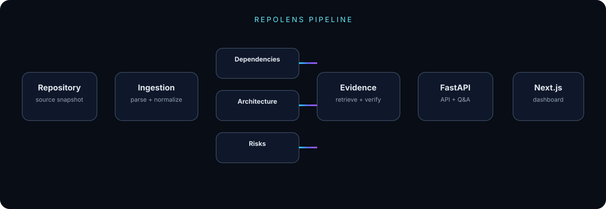

<div align="center">


<br>

<a href="https://repo-lens-three-theta.vercel.app/">

</a>
<a href="https://github.com/Frostmark1618/RepoLens">

</a>


### **Understand a codebase before you change it.**

**RepoLens converts repository structure into an inspectable engineering model — then keeps AI answers tied to evidence.**

</div>

---

## ⚡ At a Glance

<table>
<tr>
<td align="center" width="16%"><strong>103</strong><br><sub>FILES ANALYZED</sub></td>
<td align="center" width="16%"><strong>37</strong><br><sub>PYTHON FILES</sub></td>
<td align="center" width="16%"><strong>107</strong><br><sub>DEPENDENCY EDGES</sub></td>
<td align="center" width="16%"><strong>19</strong><br><sub>PRODUCTION MODULES</sub></td>
<td align="center" width="18%"><strong>73</strong><br><sub>ARCHITECTURE RELATIONS</sub></td>
<td align="center" width="18%"><strong>11</strong><br><sub>RISK SIGNALS</sub></td>
</tr>
</table>

<div align="center">

**Live demo →** https://repo-lens-three-theta.vercel.app/

</div>

---

## 🧭 What is RepoLens?

RepoLens is an **evidence-based codebase intelligence platform** for understanding unfamiliar software repositories.

Instead of asking an LLM to guess what a codebase looks like, RepoLens builds a deterministic analysis layer first:

```text
Repository
    ↓
Ingestion & Parsing
    ↓
Deterministic Analysis
    ├── Dependencies
    ├── Architecture
    ├── Risks
    └── Structural Signals
    ↓
Evidence Retrieval
    ↓
Claim Decomposition + Verification
    ↓
Grounded Q&A
```

### The core rule

> **Analyze first. Explain second. Keep the evidence visible.**

---

## ✦ Why it is different

Most repository assistants make the LLM the starting point.

RepoLens makes the **repository evidence** the starting point.

| Conventional flow | RepoLens flow |
|---|---|
| Question → LLM → answer | Question → evidence → verification → answer |
| Generated explanation can become the source of truth | Repository artifacts remain the source of truth |
| Missing evidence may become a guess | Missing evidence can become `UNKNOWN` |
| Architecture is explained conversationally | Architecture is represented as an inspectable graph |
| Risks are summarized | Risk signals can be traced to supporting evidence |

---

## 🔬 Evidence-First Q&A

RepoLens treats an LLM as an **explanation layer**, not as an authority over the repository.

### Verified fact

**Question**

> How many Python files are in the repository?

**Result**

```text
37 Python files
Status: FACT
Evidence: 5
Claims: 1
Coverage: 100%
```

### Insufficient evidence

**Question**

> Who is the author of this repository?

**Result**

```text
UNKNOWN
Status: UNKNOWN
Evidence: 0
Claims: 0
Coverage: 0%
```

The second behavior is deliberate: repository metadata belonging to a package/module is not automatically promoted into a repository-level authorship claim.

---

## 🧩 Product Surface

<table>
<tr><th>Surface</th><th>Purpose</th></tr>
<tr><td>◉ Overview</td><td>Repository-wide analysis metrics and readiness</td></tr>
<tr><td>◫ Repository</td><td>Files, relevant scope, modules and structural metadata</td></tr>
<tr><td>◎ Architecture</td><td>Module graph, layers and architecture relationships</td></tr>
<tr><td>↔ Dependencies</td><td>Incoming/outgoing dependency exploration</td></tr>
<tr><td>⚠ Risks</td><td>Structural risk signals with evidence context</td></tr>
<tr><td>⌁ Security</td><td>Conservative security/secret-like signal detection</td></tr>
<tr><td>✓ Testing</td><td>Structural test/reference signals</td></tr>
<tr><td>⌕ Evidence</td><td>Claim → evidence traceability</td></tr>
<tr><td>✦ AI Q&amp;A</td><td>Repository-grounded questions and verification</td></tr>
<tr><td>⟳ Drift</td><td>Architecture snapshot comparison</td></tr>
<tr><td>▤ Reports</td><td>Consolidated repository analysis</td></tr>
<tr><td>◈ Evaluation</td><td>Artifact and analysis consistency checks</td></tr>
</table>

---

## 🕸️ Architecture Intelligence



The architecture layer is designed to answer practical engineering questions:

- What depends on this module?
- What does this module depend on?
- Which modules are connected?
- What is the local impact surface?
- Which relationships form the architecture graph?

The goal is not to make a pretty graph.

The goal is to make **repository structure inspectable**.

---

## ⚠️ Risk Intelligence

RepoLens currently surfaces structural risk signals and lets the developer inspect their evidence context.

The public demo currently reports:

```text
Critical   0
High       2
Medium     9
Low        0
Total     11
```

These are **signals from the analyzer**, not a universal security certification.

A clean signal page does not mean that a repository is automatically secure.

---

## 🧬 Architecture Drift

RepoLens can compare architecture snapshots:

```text
        Snapshot A                 Snapshot B
             │                         │
             └──────────┬──────────────┘
                        ↓
                 Drift comparison
                        ↓
            ┌───────────┼───────────┐
            ↓           ↓           ↓
          Added       Removed     Changed
          modules      modules    structure
```

If the required baseline is unavailable, the system explicitly reports that drift cannot yet be established.

It does **not** manufacture a `no drift` result.

---

## ☁️ Public Deployment

The live application uses a separated deployment boundary:

```text
┌───────────────────────┐
│      Browser          │
│     Next.js UI        │
└──────────┬────────────┘
           │ HTTPS
           ▼
┌───────────────────────┐
│        Vercel         │
│     Next.js app       │
└──────────┬────────────┘
           │ API
           ▼
┌───────────────────────┐
│        Render         │
│      FastAPI API      │
│  deterministic layer  │
│  evidence + retrieval │
└──────────┬────────────┘
           │ server-side
           ▼
┌───────────────────────┐
│        Gemini         │
│      LLM provider     │
└───────────────────────┘
```

### Provider strategy

**Local development**

```text
Ollama
└── qwen2.5-coder:7b
```

**Public deployment**

```text
FastAPI
└── server-side Gemini
```

The Gemini credential remains a backend secret and is never exposed through `NEXT_PUBLIC_*`.

---

## 🛠️ Engineering Stack

### Frontend

`Next.js 16.3.8` · `React 19` · `TypeScript` · `Tailwind CSS`

### Backend

`Python` · `FastAPI` · `Uvicorn`

### Intelligence

`Repository Parsing` · `Dependency Analysis` · `Architecture Analysis` · `Risk Analysis` · `Evidence Retrieval` · `Claim Decomposition` · `Verification` · `Drift Comparison`

### LLM

`Ollama` · `qwen2.5-coder:7b` · `Gemini`

---

## 📁 Repository Structure

```text
RepoLens/
├── api/                 # FastAPI application + API routes
├── app/                 # Analysis/application components
├── artifacts/           # Repository analysis artifacts
├── config/              # Runtime/configuration
├── frontend/            # Next.js dashboard
├── ingestion/           # Repository ingestion + parsing
├── llm/                 # Provider boundary + repository Q&A
├── retrieval/           # Evidence retrieval
├── tests/               # Backend + regression tests
│
├── requirements.txt
├── verify_release.ps1
├── FINAL_AUDIT.md
├── RELEASE_NOTES.md
├── BROWSER_SMOKE_CHECKLIST.md
└── README.md
```

---

## 🚀 Run Locally

### Prerequisites

- Python 3.11+
- Node.js 20+
- npm
- Ollama
- `qwen2.5-coder:7b`

### Backend

```powershell
py -m pip install -r requirements.txt
py -m pytest -q
py -m uvicorn api.main:app --reload
```

Backend:

`http://127.0.0.1:8000`

API docs:

`http://127.0.0.1:8000/docs`

### Local model

```powershell
ollama pull qwen2.5-coder:7b
```

```text
LLM_PROVIDER=ollama
LLM_MODEL=qwen2.5-coder:7b
OLLAMA_BASE_URL=http://localhost:11434
LLM_TIMEOUT_SECONDS=120
```

### Frontend

```powershell
cd frontend
npm ci
npm run dev
```

Frontend:

`http://localhost:3000`

---

## 🔌 API Surface

```text
GET  /health
GET  /health/release
GET  /health/llm

GET  /api/repository/overview
GET  /api/repository/analysis
GET  /api/repository/drift

POST /api/repository/ask
```

### Frontend routes

```text
/               /repository
/architecture   /dependencies
/risks          /security
/testing        /evidence
/qa             /drift
/reports        /evaluation
```

---

## 🧪 Verification & Release

RepoLens includes automated verification for the backend and production frontend workflow.

```powershell
py -m pytest -q

cd frontend
npm run lint
npx tsc --noEmit
npm run build
```

Windows release verification:

```powershell
powershell -ExecutionPolicy Bypass -File .\verify_release.ps1
```

Release documentation:

- `FINAL_AUDIT.md`
- `RELEASE_NOTES.md`
- `BROWSER_SMOKE_CHECKLIST.md`

---

## 🔐 Engineering Principles

**Evidence over assertion**  
Claims should remain traceable to repository evidence.

**Deterministic before generative**  
Structural facts are established before the LLM explains them.

**Fail closed**  
Insufficient evidence can produce `UNKNOWN` rather than a fabricated repository fact.

**Provider isolation**  
Local and public inference providers are separated behind a provider boundary.

**Explicit limitations**  
Structural analysis is not presented as universal security, test coverage, or correctness certification.

---

## 🎯 Current Public Demo

The public demo currently opens a prepared **Requests** repository analysis so visitors can immediately explore the product.

It demonstrates:

- repository structure
- dependency graph
- architecture graph
- risk findings
- evidence ledger
- security signals
- testing signals
- repository-grounded Q&A
- drift state
- reports
- evaluation artifacts

### Current boundary

The public deployment does **not** currently expose arbitrary GitHub URL/ZIP ingestion as a public workflow.

That is intentionally documented rather than implied.

---

## 🗺️ Product Direction

```text
TODAY
Prepared repository snapshot
        ↓
Interactive codebase intelligence

NEXT
GitHub URL / Repository / ZIP
        ↓
Automated ingestion
        ↓
Full repository analysis
        ↓
Evidence-grounded intelligence
```

The architecture already separates ingestion, deterministic analysis, retrieval, verification and the LLM provider boundary so the ingestion surface can evolve independently.

---

## 👤 RepoLens

**Evidence-Based Codebase Intelligence & Architecture Drift Auditor**

Built with:

`Next.js` · `FastAPI` · `Python` · `TypeScript` · `Deterministic Analysis` · `Evidence Retrieval` · `Ollama` · `Gemini`

<div align="center">

### [▶ Open the Live Demo](https://repo-lens-three-theta.vercel.app/)

**[View Source](https://github.com/Frostmark1618/RepoLens)**

</div>
